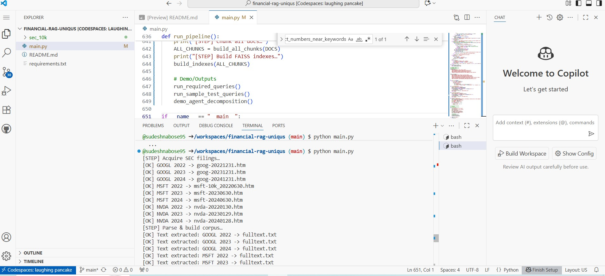

# Financial RAG with Simple Agent (10-K | GOOGL/MSFT/NVDA)

## How to run (Colab)
Run cells in order:
0) installs & imports
1) acquire filings (SEC downloads)
2) parse & extract text
3) chunking (~800 tokens)
4) embeddings & FAISS index
5–6) agent + numeric extraction
7) required queries → `sec_10k/sample_outputs.json`
8) optional tests → `sec_10k/test_outputs.json`

## Notes
- Use a descriptive SEC User-Agent with your email.
- Numeric extraction is heuristic (prefers % for margins/share, $ for revenue).
- Outputs include excerpts & chunk ids for verification.

- ## Demo Screenshots

Below are sample runs of the system inside GitHub Codespaces:

### 1. Pipeline Execution

### 2. Query Outputs

### 3. Agent Decomposition

### 4. Test Queries

### 5. FAISS Index Build

### 6. Filings Acquisition

### 7. Required Queries

